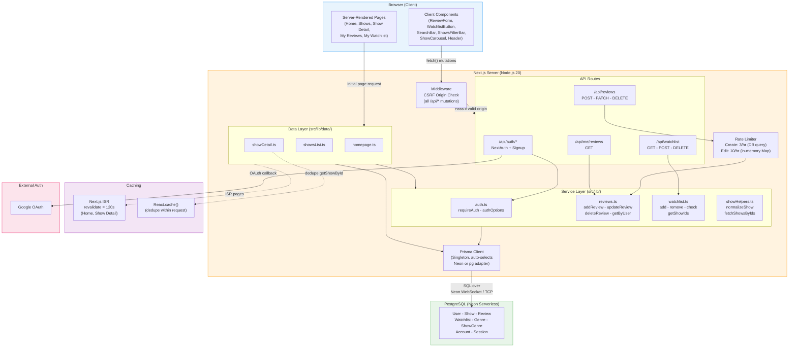
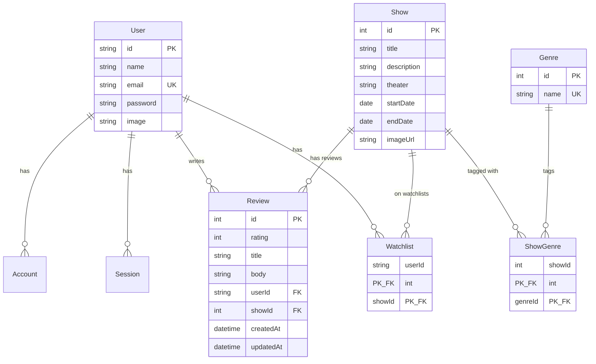

# System Design — Theatre in Israel

Last updated: 2026-02-18

## Architecture Overview

## Component Summary

| Component | Technology | Role |
|-----------|-----------|------|
| **Client** | React 19 + Next.js App Router | SSR pages + interactive client components |
| **Server** | Next.js 16 on Node.js 20 | Renders pages (SSR/ISR), hosts API routes, runs middleware |
| **Data Layer** | `src/lib/data/` | Server-side data-fetching functions consumed by page components |
| **Service Layer** | `src/lib/` | Business logic for reviews, watchlist, auth |
| **API Routes** | 7 endpoints under `src/app/api/` | REST-style mutations (reviews CRUD, watchlist CRUD, auth) |
| **Auth** | NextAuth v4 (JWT sessions) | Google OAuth + credentials provider; Prisma adapter |
| **ORM** | Prisma 7 with driver adapters | Auto-selects Neon serverless adapter or standard pg |
| **Database** | PostgreSQL (Neon) | 7 models: User, Show, Review, Watchlist, Genre, ShowGenre, Account/Session |
| **Middleware** | `src/middleware.ts` | CSRF protection on all `/api/*` mutating requests |
| **Rate Limiter** | `src/utils/reviewRateLimit.ts` | DB-based (create: 3/hr) + in-memory Map (edit/delete: 10/hr) |
| **Cache** | Next.js ISR + `React.cache()` | No external cache — ISR for home/show detail; force-dynamic for filtered lists |

## Data Flow

1. **Page loads** — Browser → Next.js Server Components → Data Layer → Prisma → PostgreSQL. Home and show detail use ISR (2-min revalidation); shows list is always dynamic.
2. **Client mutations** — Client Components call API Routes via `fetch()` → CSRF middleware → auth + rate-limit guard → Service Layer → Prisma → PostgreSQL.
3. **Auth** — Google OAuth or email/password signup. JWT sessions (30-day expiry). Server pages use `requireAuth()`; API routes use `requireApiAuth()`.

## Database Schema

## Scaling Improvements

| Area | Current State | Recommendation |
|------|--------------|----------------|
| **Caching** | No external cache; ISR only on a few pages | Add **Redis** (Upstash) for API response caching, session storage, and shared rate-limit backend |
| **Rate Limiting** | Edit/delete uses in-memory `Map` — resets on redeploy, per-instance | Move to **Redis-backed rate limiting** (`@upstash/ratelimit`) |
| **Database** | Direct queries for every filtered/paginated request | Add a **read replica** for heavy reads and/or CDN-level caching |
| **Search** | DB `LIKE` queries via URL params | Introduce **full-text search** (Postgres `tsvector` or Meilisearch/Algolia) |
| **Images** | Static images in `/public` | Offload to **CDN/image service** (Cloudinary, Imgix) for responsive sizing + format conversion |
| **Background Jobs** | Profanity filtering runs synchronously | Add a **message queue** (Inngest, QStash) for async moderation |
| **Observability** | No logging/tracing infrastructure | Add **structured logging** (Pino) + **tracing** (OpenTelemetry) + **error tracking** (Sentry) |
